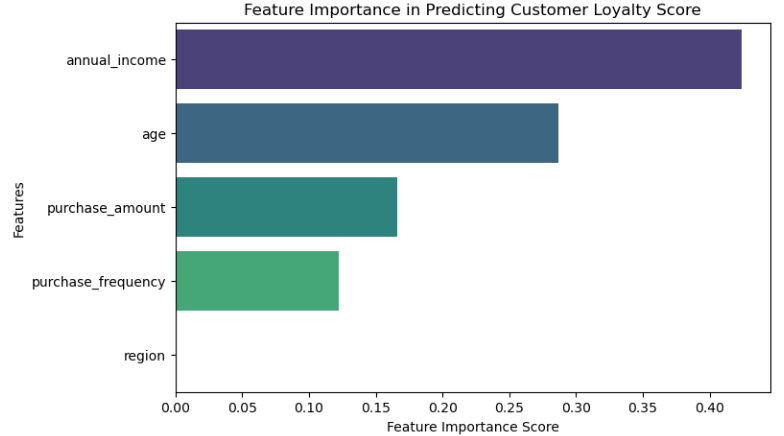

# Customer Purchasing Behavior Prediction
Data Science Institute - Cohort 5 - Team 20 Project
Goal: Predicting customer loyalty scores using demographic and purchasing behavior data. 

# Members
* Ann Paul
* Mina Wang
* Nedim Igal Ers Benveniste
* Samruddhi Rahate
* Sharon Jacob
* Suad Omar

# Project Overview
##### Source: - [Kaggle - Customer Purchasing Behaviors](https://www.kaggle.com/datasets/hanaksoy/customer-purchasing-behaviors)
##### Features: - Age, Annual Income, Region, Purchase Behavior, Loyalty Score
  
This project applies regression modeling to understand the impact of age, income, and region on customer loyalty. Our primary stakeholders include marketing teams, customer relationship managers, and business strategists, as they are responsible for optimizing customer retention strategies and improving loyalty programs. This project is relevant to them because accurately predicting loyalty scores will help them allocate resources effectively, tailor marketing campaigns, and enhance customer engagement. While our dataset may provide some insights, its small size (238 entries) raises concerns about its representativeness of the overall customer base (as we lack insight into the target population size). Additionally, the lack of date information introduces uncertainty about the data's relevance to current economic conditions. Lastly, the region is not specified in detail, making it risky to apply the regression results to wider regions or internationally. Some risks/biases that are associated with this include:
  - Region: if all data came from one region, then it would be difficult to take the same analysis and apply it on a completely different region/demographic, making it didficult to scale the obtained results
  - One vs multiple stores: if all data came from one store, then there'll be underlying bias, perhaps the store is in a wealthy neighbourhood for example. This will make the results volatile when applying it across various stores that have drastically different demographic of customer base
  - Date of purchase: the date of purchase could have also had influences over purchasing behaviour, for example if the data was recorded during a holiday season, then people's spending habits would be different from their regular days and that would skew the predictions as well

To address our business question, we will analyze key factors such as purchase frequency, salary, and region to determine their impact on loyalty scores and validate the results by splitting the dataset into training and validation portions. The primary risks involve the dataset's limited scope and potential outdatedness, which may limit the reliability and generalizability of our conclusions.

# Methodology
### Steps taken:
- Data Cleaning: Handling missing values, removing inconsistencies, and ensuring data readiness.
- Pre-analysis, finding correlation: Understanding patterns, correlations, and data distribution.
- Regression analysis and validation: Applying linear regression models to determine key loyalty drivers. and create training and test sets, assessing model accuracy.
- Visualization: Creating plots to represent insights and model results.
- Conclusion

### Technical Stack:

#### Programming Language:
Python
#### Libraries Used:
- Numpy: matrix operations
- Pandas: data analysis
- Matplotlib: creating graphs and plots
- Seaborn: enhancing matplotlib plots
- SKLearn: regression analysis

# Project Scope
### In-Scope
This project involves conducting regression analysis on customer demographic and purchasing data to identify key factors that impact customer loyalty scores. The analysis will be validated through data splitting and performance metrics to ensure reliability. Additionally, we will provide insights and recommendations for customer retention strategies based on the findings.

### Stakeholders:
- Marketing Teams – Utilize insights for campaign optimization.
- Customer Relationship Managers – Improve customer engagement and retention strategies.
- Business Strategists – Align loyalty programs with customer behaviour trends.

# Data Cleaning
Objective: cleaning any missing values and checking whether there are any non-numerical values to be transformed, and summarizing the general statistics on the dataset

Method:
- .info() was used to check for column types and missing values
- .unique() was used to check for unique values in categorical columns
- .describe() was used to generate summary statistics

Results:
- No missing values in the dataset
- One categorical factor was found: Region (North, South, West, East)
- Summary statistics shown below:
  | description  | user_id  | age | annual_income  | purchase_amount | loyalty_score | purchase_frequency |
  | ------------- | ------------- | ------------- | ------------- | ------------- | ------------- | ------------- |
  | count | 238.000000 | 238.000000 | 238.000000 | 238.000000 | 238.000000 | 238.000000 |
  | mean | 119.500000 | 38.676471 | 57407.563025 | 425.630252 | 6.794118 | 19.798319 |
  | std | 68.848868 | 9.351118 | 11403.875717 | 140.052062 | 1.899047 | 4.562884 |
  | min | 1.000000 | 22.000000 | 30000.000000 | 150.000000 | 3.000000 | 10.000000 |
  | 25% | 60.250000 | 31.000000 | 50000.000000 | 320.000000 | 5.500000 | 17.000000 |
  | 50% | 119.500000 | 39.000000 | 59000.000000 | 440.000000 | 7.000000 | 20.000000 |
  | 75% | 178.750000 | 46.750000 | 66750.000000 | 527.500000 | 8.275000 | 23.000000 |
  | max | 238.000000 | 55.000000 | 75000.000000 | 640.000000 | 9.500000 | 28.000000 |

# Exploratory Analysis 
Objective: understand and visualize the data, identify any outliers if applicable, explore correlations and how the loyalty score changes with each factor

Method: 
- Visualize distribution of key variables using histograms (age, annual income, purchase amount, purchase frequency and loyalty score)
- Visualizing the loyalty score in detail using a countplot

- Detecting outliers and checking normality using boxplots

- Using heat map to understand feature correlation

- Using pairplot to understand the correlation between each factor and the loyalty score

Results:
- There's a strong correlation between loyalty score and purchase amount as well as annual income
- The numerical factors have a positive correlation to loyalty score. Ex. the higher the annual income, the higher the loyalty score.
- There are no outliers in the data

# Regression analysis and validation
Objective: analyze the dataset using 2 different kinds of regression methods, evaluate accuracy and map the factors in order of importance to loyalty score prediction

Method (Steps taken):
- Apply encoder on categorical variable (Region)
- Split data into training and test dataset
- Scale both datasets separately
- Select model:
  Linear Regression Model: select LinearRegression()
  Random Forest Regressor: select RandomForestRegressor()
- Fit model using training dataset
- Predict results with test dataset
- Evaluate accuracy of the model using mean squared error and r2 score
  | model | mean_squared_error | r2 score |
  | --- | --- | --- |
  | Linear Regression | 0.03679285020674572 | 0.9910984665934057 |
  | Random Forest Regression | 0.0020716666666666488 | 0.9994987882173564 |

- Apply cross validation to evaluate robustness of the model (looking at mean r2 score and standard deviation)
- Extract feature importance from the model and plot it as a barplot in order of importance to the loyalty score prediction

Results:
- The most importance factor in predicting loyalty score is annual income, followed by age, purchase amount and purchase frequency
- The random forest regressor outperformed linear regression in terms of the r2 score and mean squared error
- If businesses want to identify potential customers that will have high loyalty score, they should target high income induviduals

# Conlusion
This project successfully applied regression modeling to investigate the impact of age, income, and region on customer loyalty. The analysis identified annual income as the most influential factor, followed by age, purchase amount, and purchase frequency. The Random Forest Regressor gave the same result but demonstrated superior performance compared to linear regression, offering better predictive accuracy.

While the findings provide useful insights, certain limitations must be acknowledged. The dataset's small size (238 entries) and potential biases—such as regional homogeneity or data collected from a single store—limit the generalizability of the results. Additionally, the absence of purchase date information introduces uncertainty regarding the data's alignment with current market conditions.

To improve future analyses, we recommend expanding the dataset to cover diverse regions, multiple stores, and different time periods. Despite these limitations, the results offer valuable guidance for stakeholders seeking to enhance customer retention strategies by prioritizing high-income individuals as potential loyal customers.

# Links to personal links
| Name | Links |
| --- | --- |
| Ann Paul | Link1 |
| Mina Wang | Link2 |
| Nedim Igal Ers Benveniste | Link3 |
| Samruddhi Rahate | Link4 |
| Sharon Jacob | Link5 |
| Suad Omar | Link6 |
